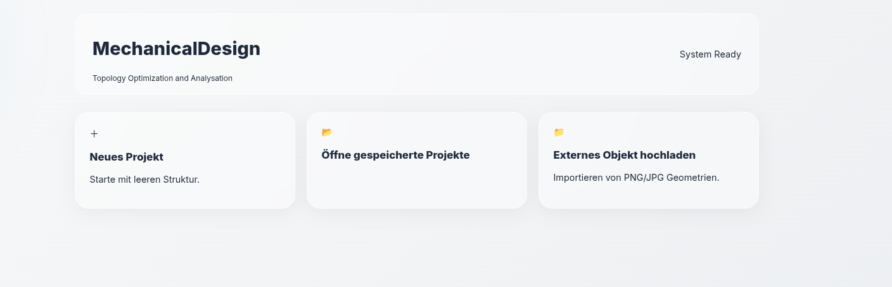
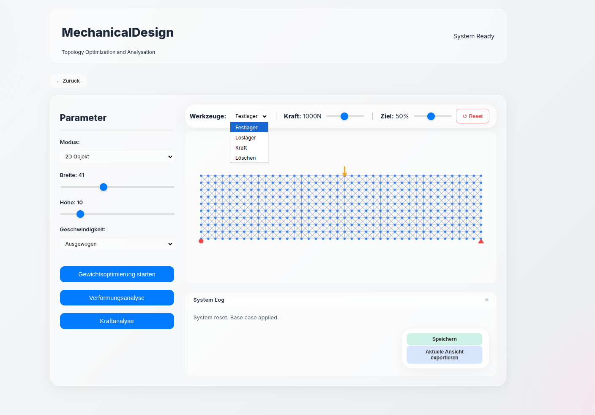
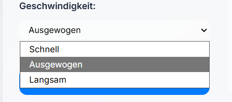
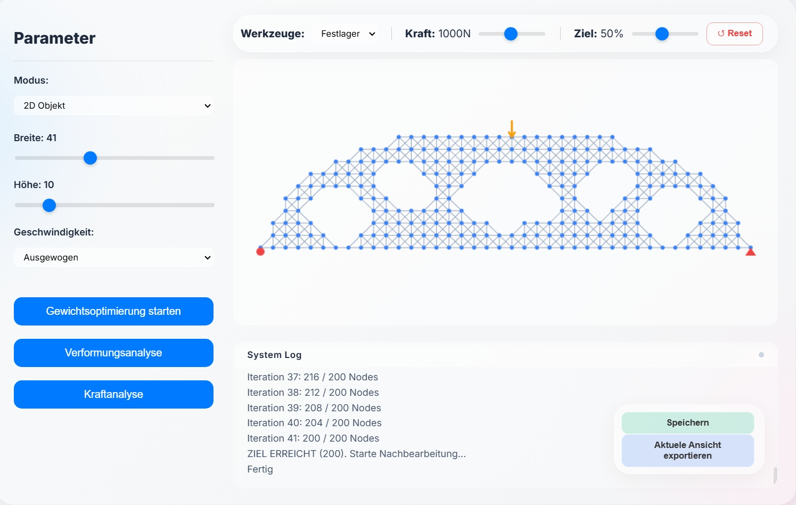
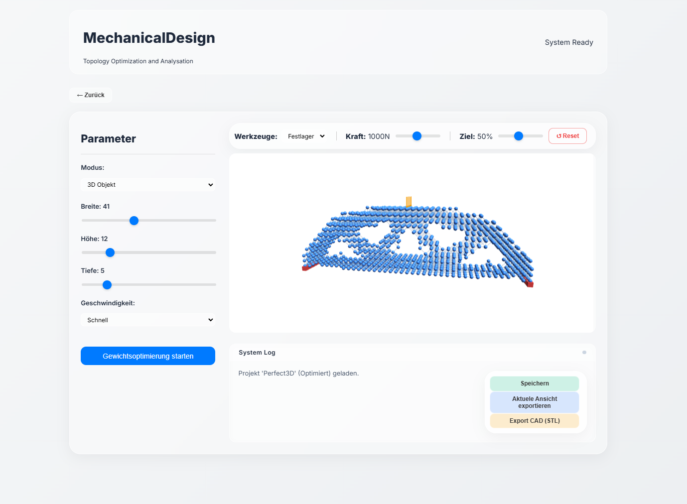
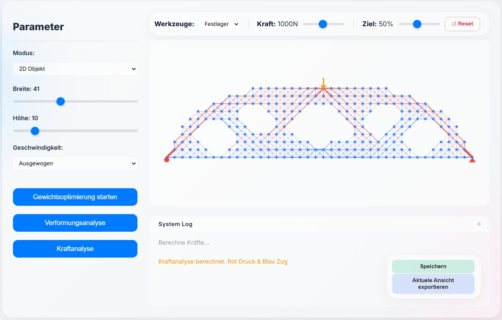
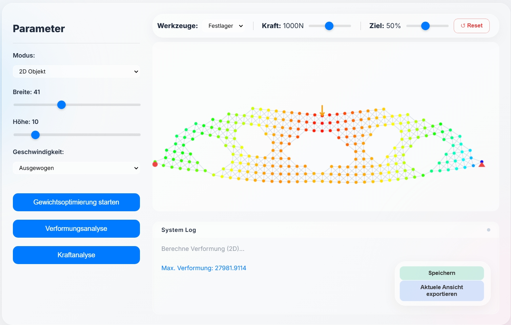
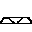

# Mechanical Analysis - Web-Based FEM & Topology Optimization

Dieses Repository enthält die Dokumentation und den Quellcode für das Projekt **"Mechanical Analysis"**. Die Webanwendung ermöglicht die interaktive Erstellung, statische Analyse und Topologieoptimierung von mechanischen Strukturen in 2D und 3D.

## Inhaltsverzeichnis
1. [Installation](#installation)
2. [Ausführung](#ausführung)
3. [Bedienung des User Interface](#bedienung-des-user-interface)
4. [Umgesetzte Features](#umgesetzte-features)
5. [Softwarestruktur & Implementierung](#softwarestruktur--implementierung)
6. [Herausforderungen & Lösungen](#herausforderungen--lösungen)

---

## Installation

### Voraussetzungen
Stellen Sie sicher, dass folgende Software installiert ist:
* **Python** (Version 3.8 oder neuer)
* **pip** (Python Package Manager)
* Ein moderner Webbrowser (Chrome, Firefox oder Edge)

### Schritte
1. **Repository klonen**
   ```bash
   git clone https://github.com/kunzechriz/MechanicalAnalysis.git
   cd MechanicalAnalysis
   ```

2. **Abhängigkeiten installieren**
   Es wird empfohlen, eine virtuelle Umgebung zu nutzen:

   ```bash
   python -m venv .venv
   # Aktivieren (Windows): .\venv\Scripts\activate
   # Aktivieren (Mac/Linux): source venv/bin/activate

   pip install -r requirements.txt
   ```

## Ausführung
Starten Sie den Flask-Server über die Kommandozeile oder führen sie die main.py anderweitig aus:

```bash
python main.py
```

Sobald der Server läuft (achten Sie auf die Ausgabe `Running on http://127.0.0.1:5000`), öffnen Sie Ihren Webbrowser und rufen Sie folgende Adresse auf:

http://127.0.0.1:5000

## Bedienung des User Interface





* "Neues Projekt" ermöglicht die interaktive Erstellung, Analyse und Optimierung von Balken. 
* Unter "Öffne gespeicherte Projekte" finden sich in der UI gespeicherte Projekte an denen man weiterarbeiten kann.
* Mit "Externes Objekt hochladen" kann man unter gewissen Rahmenbedingungen eine eigene Struktur hochladen und analysieren.

### 1. Konfiguration & Aufbau
*   **Dimensionen**: Wählen Sie Breite, Höhe und Tiefe sowie den Modus (2D/3D).
*   **Lager & Lasten**: Wählen Sie den Lagertyp (Festlager/Loslager) oder eine Kraft und klicken Sie auf die entsprechenden Knoten im Raster.



### 2. Analyse & Optimierung
*   **Optimieren**: Startet den Algorithmus zur Massenreduktion. Dabei werden ineffiziente Elemente entfernt, bis das Ziel-Massenverhältnis erreicht ist. Hier gibt es die Möglichkeit die Geschwindigkeit einzustellen.
Es wird empfohlen die Stufe "Ausgewogen" zu verwenden, bei größeren Objekten zunehmend Geschwindigkeit "Schnell".




*   **Analysieren**: Berechnet die Verformung (Kinematik) der aktuellen Struktur unter Last.
*   **Logs**: Verfolgen Sie den Fortschritt der Berechnung live im Log-Fenster.


## Umgesetzte Features

Im Rahmen des Projekts wurden folgende Erweiterungen implementiert:

*   **2D & 3D Modus**: Unterstützung für ebene und räumliche Objekte.

*   **Topologieoptimierung**: Automatisierte Gewichtsreduktion basierend auf der Last der eingestellten Kraft.
*   **Kinematische Simulation**: Berechnung von Knotenverschiebungen und Stabkräften.


*   **Persistenz**: Speichern und Laden von Projektzuständen.
*   **Live-Logging**: Server-Logs werden in Echtzeit im Frontend angezeigt.
*   **Objekt-Upload**: Hochladen von Strukturen aus einer .png Datei, wobei jedes schwarze Pixel ein Knoten darstellt und das restliche Bild weiß sein muss.
Zwei Beispiele finden sich unter `test_uploads/`.

<p align="center">
  
    
</p>

*  **Unit-Tests**: In der `tests/test_structure.py` findet sich ein KI geschriebener Unit-Test, der die Grundlegende Mathematik hinter der Knoten- und Federlogik in 2D und 3D prüft.
*  **3D-STL Export**: Im 3D-Modus besteht die Möglichkeit das Objekt als .stl-Datei herunterzuladen. Hier werden die Knoten durch Würfel ersetzt.
*  **Aktuelle Ansicht als Bild exportieren**: Im 2D und 3D Modus kann man die Aktuelle Ansicht des Objekts als Bild exportieren und herunterladen.


## Softwarestruktur & Implementierungsentscheidungen

### Architektur
Der Code folgt einem objektorientierten Ansatz, um die Erweiterbarkeit zu gewährleisten.
*   **Modellierung (`src/model`)**: Die Trennung in `Node`, `Element` und `Structure` Klassen ermöglichte es, die Logik für 2D und 3D weitgehend zu teilen. `Structure3D` erbt von `Structure2D`, überschreibt aber spezifische Methoden für den dritten Freiheitsgrad.
*   **Analyse (`src/analysis`)**: Die Optimierungslogik (`optimizer.py`) ist vom Datenmodell getrennt. Dies erlaubt es, verschiedene Optimierungsstrategien zu testen, ohne die Strukturklassen ändern zu müssen.
*   **Frontend-Technologie**: Wir haben uns bewusst gegen Frameworks wie Streamlit entschieden und stattdessen eine **HTML/JS Lösung** gewählt, die von einem lokalen **Flask-Server** gehostet wird.
    *   *Grund*: Streamlit bietet nur begrenzte Möglichkeiten für interaktive Grid-Editoren (z.B. Klick-Events auf spezifische Koordinaten im Raster). Mit nativem JavaScript und HTML5 Canvas konnten wir eine intuitive "Zeichenfläche" für Lager und Lasten realisieren, die exakt auf unsere Bedürfnisse zugeschnitten ist.

### Verwendete Technologien
*   **Backend**: Python, Flask
*   **Berechnung**: NumPy (Vektorisierung), SciPy (Sparse Solver für Performance im 3D-Modus)
*   **Frontend**: HTML, CSS, JavaScript

## Herausforderungen & Lösungen

Während der Entwicklung traten verschiedene technische Hürden auf, die wie folgt adressiert wurden:

### 1. Stabilität & Topologie (2D)
*   **Problem**: Der Optimierungsalgorithmus entfernte zufällig Elemente, was oft zu "Löchern" in der Struktur oder komplett abgetrennten Teilen führte. Dies machte die statische Berechnung unmöglich (singuläre Steifigkeitsmatrix).
*   **Lösung**: Implementierung eines Graphen-Algorithmus (`check_connectivity`), der sicherstellt, dass alle aktiven Knoten eine Verbindung zu einem Lager haben. Zusätzlich füllt die Funktion `fuelle_loecher` isolierte Lücken wieder auf, um eine robustere Geometrie zu gewährleisten.

### 2. Physikalische Korrektheit (Heatmap)
*   **Problem**: In der Visualisierung wurden Zug- und Druckkräfte zeitweise vertauscht dargestellt, was die Interpretation der Ergebnisse erschwerte.
*   **Lösung**: Korrektur der Vorzeichenlogik bei der Berechnung der Stabkräfte basierend auf der relativen Verschiebung der Knoten zueinander (Projektion auf den Richtungsvektor).

### 3. Performance bei großen Strukturen
*   **Problem**: Bei feineren Rastern (insbesondere im 3D-Modus) stieg die Rechenzeit für das Lösen des Gleichungssystems exponentiell an, was zu langen Wartezeiten im UI führte.
*   **Lösung**: Umstellung der Matrix-Operationen auf `scipy.sparse`. Da die Steifigkeitsmatrix sehr dünn besetzt ist, konnte der Speicherbedarf und die Rechenzeit drastisch reduziert werden.

### 4. 3D-Mapping (Offenes Problem)
*   **Problem**: Im 3D-Modus kommt es aktuell noch zu Diskrepanzen zwischen der Auswahl im 2D-Interface (Projektion) und den tatsächlichen Knoten im 3D-Raum. Lager und Kräfte werden teilweise nicht korrekt mit der internen Struktur verknüpft, da die Indizes beim "Hochziehen" der 2D-Eingabe in die Tiefe (z-Achse) nicht immer konsistent gemappt werden.
*   **Status**: Der Fix für das Index-Mapping ist in Arbeit und wird in einem zukünftigen Update nachgereicht.

### 5. Bild-Import & Daten-Konsistenz
* **Problem**: Die Integration einer "Image-to-Simulation"-Funktion führte zu Synchronisationsproblemen zwischen Frontend und Backend. Da hochgeladene Skizzen beliebige Dimensionen haben (z. B. 32x32 Pixel), stimmten diese oft nicht mit den voreingestellten Slider-Werten (z. B. 40x10) überein. Dies führte dazu, dass das Analysetool die Struktur nicht rendern konnte, da die Knoten-Indizes falsch waren. 
* **Lösung**: Einsatz von OpenCV (cv2) im Backend, um Bilder mittels Thresholding zu binarisieren und automatisch auf eine performante Gittergröße zu skalieren. Im Frontend wurde eine Logik implementiert, die das globale gridState beim Import dynamisch anpasst und die Bildgeometrie in einer persistenten Variable (importedActiveMap) zwischenspeichert. Dadurch bleibt die importierte Form auch bei einem Reset oder Wechsel in den Analyse-Modus erhalten, anstatt vom Standard-Rechteck überschrieben zu werden.